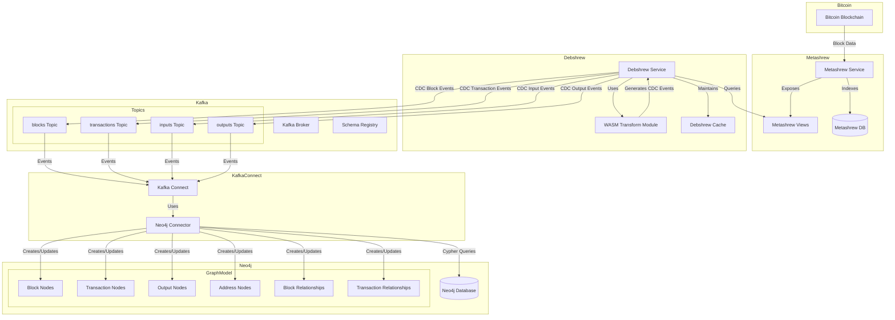
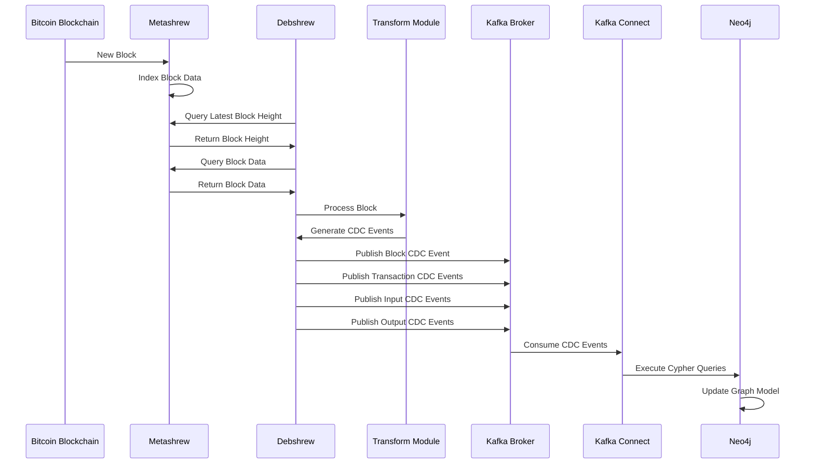
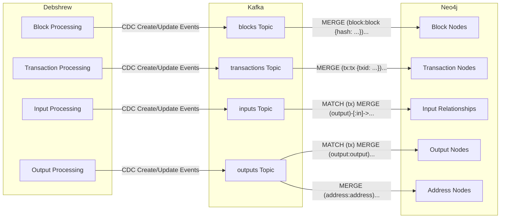
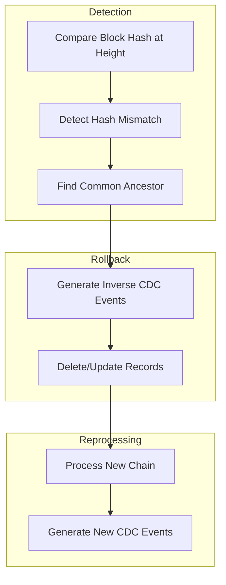
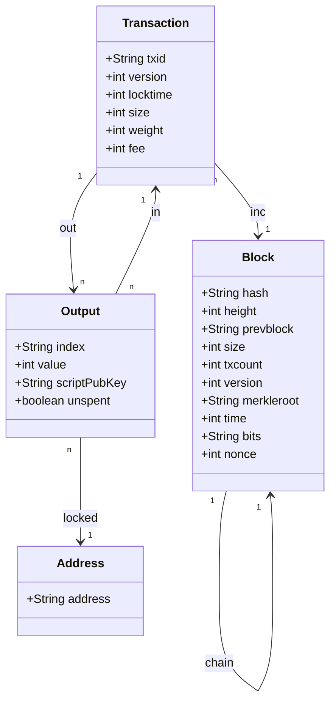

# Debshrew Kafka Neo4j Architecture

## System Architecture Diagram

## Data Flow Sequence

## CDC Event Flow

## Reorg Handling

## Neo4j Graph Model

## Component Interactions

### 1. Metashrew to Debshrew

Metashrew indexes the Bitcoin blockchain and provides views that Debshrew can query. Debshrew polls Metashrew for new blocks and processes them using the transform module.

### 2. Debshrew to Kafka

Debshrew generates CDC events for blocks, transactions, inputs, and outputs, and publishes them to Kafka topics. Each event contains the necessary data to update the Neo4j graph model.

### 3. Kafka to Neo4j

Kafka Connect consumes CDC events from Kafka topics and uses the Neo4j Sink Connector to execute Cypher queries against Neo4j. These queries create or update nodes and relationships in the graph model.

### 4. Neo4j Graph Model

The Neo4j graph model represents the Bitcoin blockchain as a graph, with blocks, transactions, outputs, and addresses as nodes, and various relationships between them.

## Data Transformation Process

1. **Bitcoin Block** → **Metashrew View** → **Debshrew CDC Event** → **Kafka Topic** → **Neo4j Cypher Query** → **Neo4j Graph Node/Relationship**

2. For each block:
   - Create a block node
   - Link it to the previous block
   - Process all transactions in the block

3. For each transaction:
   - Create a transaction node
   - Link it to the block
   - Process all inputs and outputs

4. For each input:
   - Find the referenced output
   - Create an input relationship from the output to the transaction
   - Mark the output as spent

5. For each output:
   - Create an output node
   - Link it to the transaction
   - If there's an address, create an address node and link the output to it