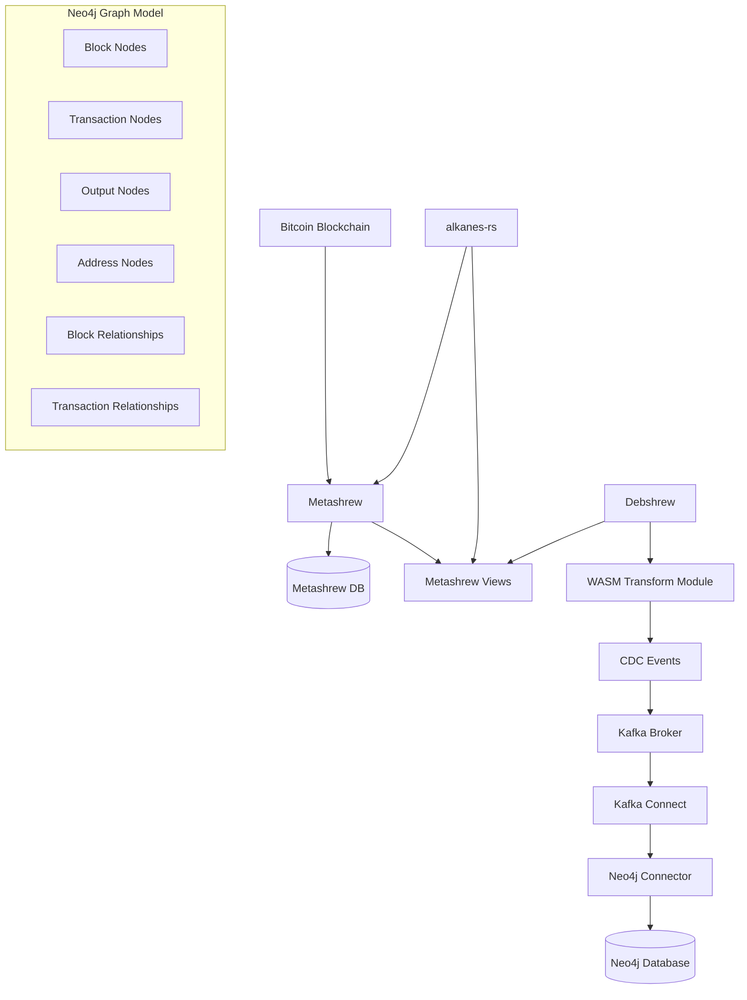

# Debshrew to Neo4j Integration: Detailed Implementation Plan

This document provides a comprehensive implementation plan for integrating Debshrew with Neo4j using Kafka as a message broker. It includes detailed information about the Metashrew views, data structures, and implementation steps.

## 1. Architecture Overview



## 2. Metashrew Views and Data Structures

Based on our analysis of the alkanes-rs codebase, we've identified the following views that are available in the Metashrew instance:

### 2.1 Available Views

1. `getblock` - Get a block by height
2. `getbytecode` - Get bytecode for an Alkane
3. `protorunes_by_outpoint` - Get Protorunes by outpoint
4. `protorunes_by_address` - Get Protorunes by address
5. `protorunes_by_height` - Get Protorunes by height
6. `alkane_inventory` - Get Alkane inventory
7. `traceblock` - Get traces for a block
8. `trace` - Get trace for a transaction

### 2.2 View Request and Response Structures

#### 2.2.1 getblock

**Request Structure:**
```rust
// From alkanes_support::proto::alkanes::BlockRequest
pub struct BlockRequest {
    pub height: u32,
    pub special_fields: ::protobuf::SpecialFields,
}
```

**Response Structure:**
```rust
// From alkanes_support::proto::alkanes::BlockResponse
pub struct BlockResponse {
    pub block: Vec<u8>, // Serialized Bitcoin block
    pub height: u32,
    pub special_fields: ::protobuf::SpecialFields,
}
```

The `block` field contains a serialized Bitcoin block that needs to be deserialized using the Bitcoin library.

## 3. Neo4j Graph Model

The Neo4j graph model consists of the following nodes and relationships:

### 3.1 Nodes

1. `block`: Represents a Bitcoin block
   - Properties: hash, size, txcount, version, prevblock, merkleroot, time, bits, nonce, height

2. `tx`: Represents a Bitcoin transaction
   - Properties: txid, version, locktime, size, weight, fee

3. `output`: Represents a transaction output
   - Properties: value, scriptPubKey, index

4. `address`: Represents a Bitcoin address
   - Properties: address

### 3.2 Relationships

1. `[:chain]`: Connects a block to its previous block
2. `[:inc]`: Connects a transaction to the block it's included in
3. `[:in]`: Connects an output (as input) to a transaction
4. `[:out]`: Connects a transaction to its outputs
5. `[:locked]`: Connects an output to the address it's locked to

## 4. Implementation Steps

### 4.1 Directory Structure

First, let's ensure we have the correct directory structure:

```
METAGRAPH/
├── alkanes-rs/
├── metashrew/
└── backend/
    ├── debshrew/
    │   ├── examples/
    │   │   └── simple-transform/
    │   │       ├── Cargo.toml
    │   │       └── src/
    │   │           └── lib.rs
    ├── debshrew-config.json
    ├── neo4j-sink-config.json
    └── docker-compose.yml
```

### 4.2 Update Cargo.toml

Create or update the `backend/debshrew/examples/simple-transform/Cargo.toml` file:

```toml
[package]
name = "simple-transform"
version = "0.1.0"
edition = "2021"

[lib]
crate-type = ["cdylib"]

[dependencies]
debshrew-runtime = { path = "../../debshrew-runtime", default-features = false }
serde = { version = "1.0", features = ["derive"] }
serde_json = "1.0"
chrono = { version = "0.4", features = ["serde"] }
hex = "0.4"
getrandom = { version = "0.2", features = ["js"] }
bitcoin = { version = "0.32.4", features = ["rand"] }

# Use relative path to alkanes-support
alkanes-support = { path = "../../../../alkanes-rs/crates/alkanes-support" }
```

### 4.3 Implement Transform Module

Create or update the `backend/debshrew/examples/simple-transform/src/lib.rs` file:

```rust
use debshrew_runtime::{self, DebTransform};
use debshrew_runtime::{CdcMessage, CdcHeader, CdcOperation, CdcPayload};
use serde::{Deserialize, Serialize};
use alkanes_support::proto::alkanes::{BlockRequest, BlockResponse};
use bitcoin::consensus::encode::deserialize;
use bitcoin::{Block, Transaction, OutPoint, TxOut, TxIn};
use bitcoin::address::Address;
use bitcoin::script::Script;
use bitcoin::network::Network;

#[derive(Default, Clone, Debug)]
pub struct BitcoinTransform {
    // State fields to track processed blocks and transactions
    last_processed_height: u32,
}

impl DebTransform for BitcoinTransform {
    fn process_block(&mut self) -> debshrew_runtime::Result<()> {
        let height = debshrew_runtime::get_height();
        let hash = debshrew_runtime::get_block_hash();
        
        debshrew_runtime::println!("Processing block {} with hash {}", height, hex::encode(&hash));
        
        // Create a BlockRequest to query Metashrew
        let block_request = BlockRequest {
            height,
            special_fields: Default::default(),
        };
        
        // Serialize the request
        let params = debshrew_runtime::serialize_params(&block_request)?;
        
        // Query Metashrew for block data
        let result = debshrew_runtime::view("getblock".to_string(), params)?;
        
        // Deserialize the response
        let block_response: BlockResponse = debshrew_runtime::deserialize_result(&result)?;
        
        // Deserialize the block
        let block: Block = deserialize(&block_response.block)?;
        
        // Generate CDC event for block
        let block_message = CdcMessage {
            header: CdcHeader {
                source: "bitcoin_transform".to_string(),
                timestamp: chrono::Utc::now(),
                block_height: height,
                block_hash: hex::encode(&hash),
                transaction_id: None,
            },
            payload: CdcPayload {
                operation: CdcOperation::Create,
                table: "blocks".to_string(),
                key: block.block_hash().to_string(),
                before: None,
                after: Some(serde_json::json!({
                    "hash": block.block_hash().to_string(),
                    "size": block.size(),
                    "txcount": block.txdata.len(),
                    "version": block.header.version.to_consensus(),
                    "prevblock": block.header.prev_blockhash.to_string(),
                    "merkleroot": block.header.merkle_root.to_string(),
                    "time": block.header.time,
                    "bits": format!("{:x}", block.header.bits.to_consensus()),
                    "nonce": block.header.nonce,
                    "height": height
                })),
            },
        };
        
        // Push block CDC message
        self.push_message(block_message)?;
        
        // Process each transaction in the block
        for (index, tx) in block.txdata.iter().enumerate() {
            let txid = tx.txid().to_string();
            
            // Generate CDC event for transaction
            let tx_message = CdcMessage {
                header: CdcHeader {
                    source: "bitcoin_transform".to_string(),
                    timestamp: chrono::Utc::now(),
                    block_height: height,
                    block_hash: hex::encode(&hash),
                    transaction_id: Some(txid.clone()),
                },
                payload: CdcPayload {
                    operation: CdcOperation::Create,
                    table: "transactions".to_string(),
                    key: txid.clone(),
                    before: None,
                    after: Some(serde_json::json!({
                        "txid": txid,
                        "version": tx.version.to_consensus(),
                        "locktime": tx.lock_time.to_consensus_u32(),
                        "size": tx.size(),
                        "weight": tx.weight(),
                        "fee": 0, // Fee calculation would be done in Neo4j
                        "index_in_block": index
                    })),
                },
            };
            
            // Push transaction CDC message
            self.push_message(tx_message)?;
            
            // Process inputs
            for (vin, input) in tx.input.iter().enumerate() {
                let input_key = format!("{}:{}", txid, vin);
                let prev_txid = input.previous_output.txid.to_string();
                let prev_vout = input.previous_output.vout;
                
                let input_message = CdcMessage {
                    header: CdcHeader {
                        source: "bitcoin_transform".to_string(),
                        timestamp: chrono::Utc::now(),
                        block_height: height,
                        block_hash: hex::encode(&hash),
                        transaction_id: Some(txid.clone()),
                    },
                    payload: CdcPayload {
                        operation: CdcOperation::Create,
                        table: "inputs".to_string(),
                        key: input_key.clone(),
                        before: None,
                        after: Some(serde_json::json!({
                            "txid": txid,
                            "vin": vin,
                            "prev_txid": prev_txid,
                            "prev_vout": prev_vout,
                            "scriptSig": hex::encode(&input.script_sig.as_bytes()),
                            "sequence": input.sequence.to_consensus_u32(),
                            "witness": input.witness.iter().map(|w| hex::encode(w)).collect::<Vec<String>>(),
                            "index": format!("{}:{}:{}:{}", txid, vin, prev_txid, prev_vout)
                        })),
                    },
                };
                
                // Push input CDC message
                self.push_message(input_message)?;
            }
            
            // Process outputs
            for (vout, output) in tx.output.iter().enumerate() {
                let output_key = format!("{}:{}", txid, vout);
                
                // Extract addresses from script_pubkey
                let addresses = extract_addresses(output);
                
                let output_message = CdcMessage {
                    header: CdcHeader {
                        source: "bitcoin_transform".to_string(),
                        timestamp: chrono::Utc::now(),
                        block_height: height,
                        block_hash: hex::encode(&hash),
                        transaction_id: Some(txid.clone()),
                    },
                    payload: CdcPayload {
                        operation: CdcOperation::Create,
                        table: "outputs".to_string(),
                        key: output_key.clone(),
                        before: None,
                        after: Some(serde_json::json!({
                            "txid": txid,
                            "vout": vout,
                            "value": output.value,
                            "scriptPubKey": hex::encode(&output.script_pubkey.as_bytes()),
                            "addresses": addresses.join(","),
                            "index": output_key
                        })),
                    },
                };
                
                // Push output CDC message
                self.push_message(output_message)?;
            }
        }
        
        // Update state
        self.last_processed_height = height;
        
        debshrew_runtime::println!("Block processing complete");
        
        Ok(())
    }
    
    // We don't need to implement rollback() as the default implementation
    // will use the automatically generated inverse operations
}

// Helper function to extract addresses from a transaction output
fn extract_addresses(output: &TxOut) -> Vec<String> {
    let script = &output.script_pubkey;
    let mut addresses = Vec::new();
    
    // Try to extract addresses for different networks
    for network in &[Network::Bitcoin, Network::Testnet, Network::Regtest] {
        if let Ok(address) = Address::from_script(script, *network) {
            addresses.push(address.to_string());
        }
    }
    
    // If no addresses were found, try to extract from script
    if addresses.is_empty() {
        // P2PKH
        if script.is_p2pkh() {
            if let Some(pubkey_hash) = script.as_p2pkh() {
                addresses.push(format!("p2pkh:{}", hex::encode(pubkey_hash)));
            }
        }
        // P2SH
        else if script.is_p2sh() {
            if let Some(script_hash) = script.as_p2sh() {
                addresses.push(format!("p2sh:{}", hex::encode(script_hash)));
            }
        }
        // P2WPKH
        else if script.is_v0_p2wpkh() {
            if let Some(pubkey_hash) = script.as_v0_p2wpkh() {
                addresses.push(format!("p2wpkh:{}", hex::encode(pubkey_hash)));
            }
        }
        // P2WSH
        else if script.is_v0_p2wsh() {
            if let Some(script_hash) = script.as_v0_p2wsh() {
                addresses.push(format!("p2wsh:{}", hex::encode(script_hash)));
            }
        }
        // If still no addresses, use the script hex
        if addresses.is_empty() {
            addresses.push(format!("script:{}", hex::encode(script.as_bytes())));
        }
    }
    
    addresses
}

// Register the transform
debshrew_runtime::declare_transform!(BitcoinTransform);
```

### 4.4 Configure Debshrew

Create or update the `backend/debshrew-config.json` file:

```json
{
  "metashrew": {
    "url": "http://localhost:8080",
    "timeout": 30,
    "max_retries": 3,
    "retry_delay": 1000
  },
  "transform": {
    "path": "./backend/debshrew/examples/simple-transform/target/wasm32-unknown-unknown/release/simple_transform.wasm"
  },
  "sink": {
    "type": "kafka",
    "bootstrap_servers": "localhost:29092",
    "topic_prefix": "debshrew.cdc",
    "client_id": "debshrew",
    "batch_size": 100,
    "flush_interval": 1000
  },
  "cache_size": 6,
  "start_height": 880000,
  "log_level": "info"
}
```

### 4.5 Configure Neo4j Sink Connector

Create or update the `backend/neo4j-sink-config.json` file:

```json
{
  "name": "neo4j-sink",
  "config": {
    "connector.class": "streams.kafka.connect.sink.Neo4jSinkConnector",
    "topics": "debshrew.cdc.blocks,debshrew.cdc.transactions,debshrew.cdc.inputs,debshrew.cdc.outputs",
    "neo4j.server.uri": "bolt://neo4j:7687",
    "neo4j.authentication.basic.username": "neo4j",
    "neo4j.authentication.basic.password": "password",
    "neo4j.topic.cypher.debshrew.cdc.blocks": "MERGE (block:block {hash: event.after.hash}) SET block.size = event.after.size, block.txcount = event.after.txcount, block.version = event.after.version, block.prevblock = event.after.prevblock, block.merkleroot = event.after.merkleroot, block.time = event.after.time, block.bits = event.after.bits, block.nonce = event.after.nonce, block.height = event.after.height MERGE (prevblock:block {hash: event.after.prevblock}) MERGE (block)-[:chain]->(prevblock)",
    "neo4j.topic.cypher.debshrew.cdc.transactions": "MATCH (block:block {hash: event.header.block_hash}) MERGE (tx:tx {txid: event.after.txid}) MERGE (tx)-[:inc {i: event.after.index_in_block}]->(block) SET tx.version = event.after.version, tx.locktime = event.after.locktime, tx.size = event.after.size, tx.weight = event.after.weight, tx.fee = event.after.fee",
    "neo4j.topic.cypher.debshrew.cdc.inputs": "MATCH (tx:tx {txid: event.after.txid}) MERGE (prevOutput:output {index: event.after.prev_txid + ':' + event.after.prev_vout}) MERGE (prevOutput)-[:in {vin: event.after.vin, scriptSig: event.after.scriptSig, sequence: event.after.sequence, witness: event.after.witness}]->(tx) REMOVE prevOutput:unspent",
    "neo4j.topic.cypher.debshrew.cdc.outputs": "MATCH (tx:tx {txid: event.after.txid}) MERGE (output:output {index: event.after.index}) SET output.value = event.after.value, output.scriptPubKey = event.after.scriptPubKey, output:unspent MERGE (tx)-[:out {vout: event.after.vout}]->(output) WITH output, event WHERE event.after.addresses IS NOT NULL AND size(event.after.addresses) > 0 MERGE (address:address {address: event.after.addresses}) MERGE (output)-[:locked]->(address)",
    "key.converter": "org.apache.kafka.connect.storage.StringConverter",
    "value.converter": "org.apache.kafka.connect.json.JsonConverter",
    "value.converter.schemas.enable": "false",
    "errors.tolerance": "all",
    "errors.log.enable": "true",
    "errors.log.include.messages": "true"
  }
}
```

### 4.6 Update Docker Compose

Create or update the `backend/docker-compose.yml` file:

```yaml
version: '3'

services:
  neo4j:
    image: neo4j:4.4
    container_name: bitcoin-neo4j
    ports:
      - "7474:7474"  # HTTP
      - "7687:7687"  # Bolt
    environment:
      - NEO4J_AUTH=neo4j/password
      - NEO4J_dbms_memory_pagecache_size=1G
      - NEO4J_dbms_memory_heap_initial__size=1G
      - NEO4J_dbms_memory_heap_max__size=2G
    volumes:
      - neo4j_data:/data
      - neo4j_logs:/logs
      - neo4j_import:/var/lib/neo4j/import
      - neo4j_plugins:/plugins
    restart: unless-stopped
    networks:
      - bitcoin-network

  # Zookeeper - required for Kafka
  zookeeper:
    image: confluentinc/cp-zookeeper:7.4.0
    container_name: zookeeper
    ports:
      - "2181:2181"
    environment:
      ZOOKEEPER_CLIENT_PORT: 2181
      ZOOKEEPER_TICK_TIME: 2000
    restart: unless-stopped
    networks:
      - bitcoin-network

  # Kafka broker
  kafka:
    image: confluentinc/cp-kafka:7.4.0
    container_name: kafka
    depends_on:
      - zookeeper
    ports:
      - "9092:9092"
      - "29092:29092"
    environment:
      KAFKA_BROKER_ID: 1
      KAFKA_ZOOKEEPER_CONNECT: zookeeper:2181
      KAFKA_ADVERTISED_LISTENERS: PLAINTEXT://kafka:9092,PLAINTEXT_HOST://localhost:29092
      KAFKA_LISTENER_SECURITY_PROTOCOL_MAP: PLAINTEXT:PLAINTEXT,PLAINTEXT_HOST:PLAINTEXT
      KAFKA_INTER_BROKER_LISTENER_NAME: PLAINTEXT
      KAFKA_OFFSETS_TOPIC_REPLICATION_FACTOR: 1
      KAFKA_GROUP_INITIAL_REBALANCE_DELAY_MS: 0
      KAFKA_TRANSACTION_STATE_LOG_MIN_ISR: 1
      KAFKA_TRANSACTION_STATE_LOG_REPLICATION_FACTOR: 1
    restart: unless-stopped
    networks:
      - bitcoin-network

  # Schema Registry - for managing CDC event schemas
  schema-registry:
    image: confluentinc/cp-schema-registry:7.4.0
    container_name: schema-registry
    depends_on:
      - kafka
    ports:
      - "8081:8081"
    environment:
      SCHEMA_REGISTRY_HOST_NAME: schema-registry
      SCHEMA_REGISTRY_KAFKASTORE_BOOTSTRAP_SERVERS: kafka:9092
      SCHEMA_REGISTRY_LISTENERS: http://0.0.0.0:8081
    restart: unless-stopped
    networks:
      - bitcoin-network

  # Kafka Connect - for the Neo4j Sink Connector
  kafka-connect:
    image: confluentinc/cp-kafka-connect:7.4.0
    container_name: kafka-connect
    depends_on:
      - kafka
      - schema-registry
    ports:
      - "8083:8083"
    environment:
      CONNECT_BOOTSTRAP_SERVERS: kafka:9092
      CONNECT_REST_PORT: 8083
      CONNECT_GROUP_ID: "connect-cluster"
      CONNECT_CONFIG_STORAGE_TOPIC: "connect-configs"
      CONNECT_OFFSET_STORAGE_TOPIC: "connect-offsets"
      CONNECT_STATUS_STORAGE_TOPIC: "connect-status"
      CONNECT_CONFIG_STORAGE_REPLICATION_FACTOR: 1
      CONNECT_OFFSET_STORAGE_REPLICATION_FACTOR: 1
      CONNECT_STATUS_STORAGE_REPLICATION_FACTOR: 1
      CONNECT_KEY_CONVERTER: "org.apache.kafka.connect.storage.StringConverter"
      CONNECT_VALUE_CONVERTER: "org.apache.kafka.connect.json.JsonConverter"
      CONNECT_VALUE_CONVERTER_SCHEMAS_ENABLE: "false"
      CONNECT_REST_ADVERTISED_HOST_NAME: "kafka-connect"
      CONNECT_PLUGIN_PATH: "/usr/share/java,/usr/share/confluent-hub-components,/connectors"
    volumes:
      - kafka_connect_plugins:/connectors
    command:
      - bash
      - -c
      - |
        echo "Installing Neo4j Sink Connector..."
        confluent-hub install --no-prompt neo4j/kafka-connect-neo4j:5.0.2
        echo "Launching Kafka Connect..."
        /etc/confluent/docker/run
    restart: unless-stopped
    networks:
      - bitcoin-network

  # Kafka UI - for monitoring Kafka
  kafka-ui:
    image: provectuslabs/kafka-ui:latest
    container_name: kafka-ui
    depends_on:
      - kafka
      - schema-registry
    ports:
      - "8080:8080"
    environment:
      KAFKA_CLUSTERS_0_NAME: local
      KAFKA_CLUSTERS_0_BOOTSTRAPSERVERS: kafka:9092
      KAFKA_CLUSTERS_0_SCHEMAREGISTRY: http://schema-registry:8081
      KAFKA_CLUSTERS_0_KAFKACONNECT_0_NAME: connect
      KAFKA_CLUSTERS_0_KAFKACONNECT_0_ADDRESS: http://kafka-connect:8083
    restart: unless-stopped
    networks:
      - bitcoin-network

volumes:
  neo4j_data:
  neo4j_logs:
  neo4j_import:
  neo4j_plugins:
  kafka_connect_plugins:

networks:
  bitcoin-network:
    driver: bridge
```

### 4.7 Create Setup Script

Create a setup script to automate the deployment process:

```bash
#!/bin/bash

# Exit on error
set -e

echo "Setting up Debshrew with Kafka and Neo4j..."

# Step 1: Start Docker Compose services
echo "Starting Docker Compose services..."
cd "$(dirname "$0")"
docker-compose down
docker-compose up -d

# Wait for Kafka Connect to be ready
echo "Waiting for Kafka Connect to be ready..."
until curl -s -f http://localhost:8083/connectors > /dev/null; do
  echo "Kafka Connect not ready yet, waiting..."
  sleep 5
done
echo "Kafka Connect is ready!"

# Step 2: Create Kafka topics
echo "Creating Kafka topics..."
docker exec kafka kafka-topics --create --if-not-exists --bootstrap-server kafka:9092 --partitions 1 --replication-factor 1 --topic debshrew.cdc.blocks
docker exec kafka kafka-topics --create --if-not-exists --bootstrap-server kafka:9092 --partitions 1 --replication-factor 1 --topic debshrew.cdc.transactions
docker exec kafka kafka-topics --create --if-not-exists --bootstrap-server kafka:9092 --partitions 1 --replication-factor 1 --topic debshrew.cdc.inputs
docker exec kafka kafka-topics --create --if-not-exists --bootstrap-server kafka:9092 --partitions 1 --replication-factor 1 --topic debshrew.cdc.outputs

# Step 3: Configure Neo4j Sink Connector
echo "Configuring Neo4j Sink Connector..."
curl -X POST -H "Content-Type: application/json" --data @neo4j-sink-config.json http://localhost:8083/connectors

# Step 4: Build the transform module
echo "Building the transform module..."
cd debshrew/examples/simple-transform
cargo build --target wasm32-unknown-unknown --release
cd ../../..

# Step 5: Initialize Neo4j database
echo "Initializing Neo4j database..."
node src/scripts/initDatabase.js

echo "Setup complete! You can now run Debshrew with:"
echo "cargo run --release -- run --config debshrew-config.json"
```

## 5. Testing Steps

### 5.1 Build the Transform Module

```bash
cd backend/debshrew/examples/simple-transform
cargo build --target wasm32-unknown-unknown --release
```

### 5.2 Start Docker Services

```bash
cd ../../../  # Return to the backend directory
docker-compose down
docker-compose up -d
```

### 5.3 Create Kafka Topics

```bash
docker exec kafka kafka-topics --create --if-not-exists --bootstrap-server kafka:9092 --partitions 1 --replication-factor 1 --topic debshrew.cdc.blocks
docker exec kafka kafka-topics --create --if-not-exists --bootstrap-server kafka:9092 --partitions 1 --replication-factor 1 --topic debshrew.cdc.transactions
docker exec kafka kafka-topics --create --if-not-exists --bootstrap-server kafka:9092 --partitions 1 --replication-factor 1 --topic debshrew.cdc.inputs
docker exec kafka kafka-topics --create --if-not-exists --bootstrap-server kafka:9092 --partitions 1 --replication-factor 1 --topic debshrew.cdc.outputs
```

### 5.4 Configure Neo4j Sink Connector

```bash
curl -X POST -H "Content-Type: application/json" --data @neo4j-sink-config.json http://localhost:8083/connectors
```

### 5.5 Initialize Neo4j Database

```bash
node src/scripts/initDatabase.js
```

### 5.6 Ensure Metashrew is Running

```bash
./metashrew/target/release/rockshrew-mono --daemon-rpc-url https://mainnet.sandshrew.io/v2/lasereyes --indexer ./alkanes-rs/target/wasm32-unknown-unknown/release/alkanes.wasm --db-path ./.metashrew --host 0.0.0.0 --port 8080 --start-block 880000 --cors '*'
```

### 5.7 Run Debshrew

```bash
cd debshrew
cargo run --release -- run --config ../debshrew-config.json
```

## 6. Monitoring and Verification

### 6.1 Monitor Kafka Topics

Use the Kafka UI to monitor the CDC events being generated:

```
http://localhost:8080
```

### 6.2 Check Neo4j Database

Use the Neo4j Browser to check if the data is being properly stored:

```
http://localhost:7474
```

### 6.3 Verify Graph Structure

Run the following Cypher queries to verify the graph structure:

```cypher
// Get the latest blocks
MATCH (b:block)
WHERE b.height IS NOT NULL
RETURN b
ORDER BY b.height DESC
LIMIT 10

// Get transactions in a block
MATCH (b:block {height: 880000})<-[:inc]-(tx:tx)
RETURN tx
ORDER BY tx.txid
LIMIT 10

// Get UTXOs for an address
MATCH (a:address {address: "bc1q..."})<-[:locked]-(o:output)
WHERE NOT EXISTS((o)-[:in]->(:tx))
RETURN o
LIMIT 10
```

## 7. Potential Issues and Solutions

### 7.1 Dependency Path Issues

If you encounter issues with the dependency paths, you may need to adjust the paths in the Cargo.toml file. The paths should be relative to the location of the Cargo.toml file.

### 7.2 Metashrew View Names

If the view names used in the transform module don't match the actual view names exposed by your Metashrew instance, you may need to adjust them. You can check the available views by examining the Metashrew logs or by looking at the source code.

### 7.3 Data Structure Mismatches

If the structures defined in the transform module don't match the actual data returned by Metashrew, you may need to adjust them. You can check the actual data structures by examining the Metashrew logs or by looking at the source code.

### 7.4 Path to WASM File

Make sure the path to the WASM file in the debshrew-config.json is correct. You may need to adjust it based on your specific setup.

### 7.5 Dependency Versions

