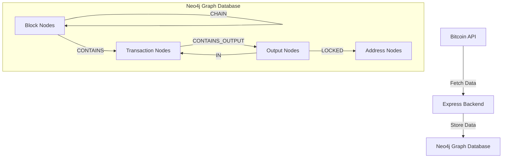

# Revised Backend Architecture Plan for METAGRAPH

Based on the best practice model in the bitcoin-to-neo4j implementation, I've revised our architecture plan to focus on creating a solid graph structure in Neo4j before integrating with the frontend. This plan follows a more sequential logic for API querying while enabling us to start at any block.

## Simplified Architecture Overview



## Neo4j Graph Structure

Following the bitcoin-to-neo4j model, we'll use a simpler and more efficient graph structure:

### Node Labels

1. **:block** - Represents a Bitcoin block
2. **:tx** - Represents a Bitcoin transaction
3. **:output** - Represents a transaction output (UTXO)
4. **:address** - Represents a Bitcoin address
5. **:coinbase** - Special output for block rewards

### Relationships

1. **[:chain]** - Connects a block to its previous block
2. **[:inc]** - Connects a transaction to the block it's included in
3. **[:in]** - Connects an output to the transaction that spends it
4. **[:out]** - Connects a transaction to the outputs it creates
5. **[:locked]** - Connects an output to the address it's locked to
6. **[:coinbase]** - Connects a block to its coinbase output

### Node Properties

#### Block Node
```cypher
{
  hash: "000000000000...",       // Block hash
  prevblock: "000000000000...",  // Previous block hash
  height: 123456,                // Block height
  time: 1617123456,              // Block timestamp
  size: 1234567,                 // Block size in bytes
  txcount: 2500,                 // Number of transactions
  version: 1,                    // Block version
  merkleroot: "...",             // Merkle root hash
  bits: "...",                   // Target in compact format
  nonce: 123456789               // Nonce value
}
```

#### Transaction Node
```cypher
{
  txid: "abcdef1234...",         // Transaction ID
  version: 1,                    // Transaction version
  locktime: 0,                   // Transaction locktime
  size: 1234,                    // Transaction size in bytes
  fee: 0.0001                    // Transaction fee in BTC
}
```

#### Output Node
```cypher
{
  index: "txid:n",               // Unique identifier (txid:vout)
  value: 0.1,                    // Output value in BTC
  scriptPubKey: "...",           // Output script
  spent: false                   // Whether the output has been spent
}
```

#### Address Node
```cypher
{
  address: "bc1q..."             // Bitcoin address
}
```

## Implementation Phases

### Phase 1: Neo4j Setup and Core Schema

1. **Set up Neo4j Database**
   - Install Neo4j (Docker container for development)
   - Create constraints and indexes for efficient querying
   - Define Cypher queries for blocks, transactions, and addresses

2. **Create Core Schema**
   ```cypher
   // Create constraints for unique nodes
   CREATE CONSTRAINT block_hash_unique IF NOT EXISTS FOR (b:block) REQUIRE b.hash IS UNIQUE;
   CREATE CONSTRAINT tx_txid_unique IF NOT EXISTS FOR (tx:tx) REQUIRE tx.txid IS UNIQUE;
   CREATE CONSTRAINT output_index_unique IF NOT EXISTS FOR (o:output) REQUIRE o.index IS UNIQUE;
   CREATE CONSTRAINT address_address_unique IF NOT EXISTS FOR (a:address) REQUIRE a.address IS UNIQUE;
   
   // Create indexes for frequent queries
   CREATE INDEX block_height_index IF NOT EXISTS FOR (b:block) ON (b.height);
   CREATE INDEX address_index IF NOT EXISTS FOR (a:address) ON (a.address);
   ```

### Phase 2: Data Fetching and Storage

1. **Block Fetching Service**
   - Create a service to fetch blocks from Bitcoin API
   - Support fetching by height or hash
   - Handle sequential block fetching

2. **Transaction Processing Service**
   - Create a service to process transactions within blocks
   - Extract inputs, outputs, and addresses
   - Calculate fees and other derived data

3. **Neo4j Storage Service**
   - Create a service to store blocks and transactions in Neo4j
   - Use efficient Cypher queries for data insertion
   - Handle orphan blocks and chain reorganizations

### Phase 3: Sequential Block Processing

1. **Sequential Block Processor**
   - Start from a specified block (genesis or any other)
   - Process blocks in sequential order
   - Handle chain reorganizations

2. **Orphan Block Handler**
   - Track orphan blocks (blocks with unknown parent)
   - Resolve orphans when their parent blocks are processed
   - Update block heights and relationships

3. **Chain Tip Tracker**
   - Track the current tip of the blockchain
   - Handle multiple chain tips during reorganizations
   - Select the chain with the most cumulative work

## Cypher Queries

### Block Insertion

```cypher
// Create Block
MERGE (block:block {hash:$blockhash})
MERGE (block)-[:coinbase]->(:output:coinbase)
SET
    block.size=$blocksize,
    block.txcount=$txcount,
    block.version=$version,
    block.prevblock=$prevblock,
    block.merkleroot=$merkleroot,
    block.time=$timestamp,
    block.bits=$bits,
    block.nonce=$nonce

// Create Chain
MERGE (prevblock:block {hash:$prevblock})
MERGE (block)-[:chain]->(prevblock)

// Set Height
SET block.height=prevblock.height+1

// Return
RETURN block.height as height, block.prevblock as prevblock
```

### Genesis Block Insertion

```cypher
// Create Block
MERGE (block:block {hash:$blockhash})
MERGE (block)-[:coinbase]->(:output:coinbase)
SET
    block.size=$blocksize,
    block.txcount=$txcount,
    block.version=$version,
    block.prevblock=$prevblock,
    block.merkleroot=$merkleroot,
    block.time=$timestamp,
    block.bits=$bits,
    block.nonce=$nonce

// Set Height
SET block.height=0

// Return
RETURN block.height as height, block.prevblock as prevblock
```

### Transaction Insertion

```cypher
// Create Transaction
MATCH (block :block {hash:$blockhash})
MERGE (tx:tx {txid:$txid})
MERGE (tx)-[:inc {i:$t}]->(block)
SET tx += $tx

// Inputs
WITH tx
FOREACH (input in $inputs |
    MERGE (in :output {index: input.index})
    MERGE (in)-[:in {vin: input.vin, scriptSig: input.scriptSig, sequence: input.sequence, witness: input.witness}]->(tx)
    REMOVE in:unspent
)

// Outputs
FOREACH (output in $outputs |
    MERGE (out :output {index: output.index})
    MERGE (tx)-[:out {vout: output.vout}]->(out)
    // This uses the foreach hack to only create an address node if the address value is not an empty string
    FOREACH(ignoreMe IN CASE WHEN output.addresses <> '' THEN [1] ELSE [] END |
        MERGE (address :address {address: output.addresses})
        MERGE (out)-[:locked]->(address)
    )

    MERGE (out)-[:in]->(existing)
    ON CREATE SET
        out.value= output.value,
        out.scriptPubKey= output.scriptPubKey
    ON MATCH SET
        out.value= output.value,
        out.scriptPubKey= output.scriptPubKey,
        existing.fee = existing.fee + output.value
)

// Fee
WITH tx
MATCH (i :output)-[:in]->(tx)
WITH tx, sum(i.value) - $outtotal as fee
SET tx.fee=fee

// Return
RETURN fee
```

### Coinbase Transaction Insertion

```cypher
// Create Transaction
MATCH (block :block {hash:$blockhash})-[:coinbase]->(coinbase :coinbase)
MERGE (tx:tx {txid:$txid})
MERGE (tx)-[:inc {i:$t}]->(block)
SET tx += $tx

// Coinbase Input
MERGE (coinbase)-[coinbasein:in {vin:0, scriptSig:$coinbase_script, sequence:$coinbase_sequence}]->(tx)
FOREACH (input in $inputs |
  SET coinbasein.witness = input.witness
)

// Outputs
WITH tx
FOREACH (output in $outputs |
  MERGE (out :output {index: output.index})
  MERGE (tx)-[:out {vout: output.vout}]->(out)
  // This uses the foreach hack to only create an address node if the address value is not an empty string
  FOREACH(ignoreMe IN CASE WHEN output.addresses <> '' THEN [1] ELSE [] END |
    MERGE (address :address {address: output.addresses})
    MERGE (out)-[:locked]->(address)
  )

  MERGE (out)-[:in]->(existing)
  ON CREATE SET
    out.value= output.value,
    out.scriptPubKey= output.scriptPubKey
  ON MATCH SET
    out.value= output.value,
    out.scriptPubKey= output.scriptPubKey,
    existing.fee = existing.fee + output.value
)

// Fee
WITH tx
MATCH (i :output)-[:in]->(tx)
WITH tx, sum(i.value) - $outtotal as fee
SET tx.fee=fee

// Return
RETURN fee
```

## Express Backend Structure

```
backend/
├── src/
│   ├── config/
│   │   ├── neo4j.js       # Neo4j connection configuration
│   │   └── bitcoin.js     # Bitcoin API configuration
│   ├── services/
│   │   ├── blockService.js       # Block fetching and processing
│   │   ├── transactionService.js # Transaction processing
│   │   ├── neo4jService.js       # Neo4j data storage
│   │   └── chainService.js       # Chain management
│   ├── models/
│   │   ├── block.js       # Block model
│   │   ├── transaction.js # Transaction model
│   │   ├── output.js      # Output model
│   │   └── address.js     # Address model
│   ├── utils/
│   │   ├── bitcoin.js     # Bitcoin-specific utilities
│   │   ├── neo4j.js       # Neo4j utilities
│   │   └── logger.js      # Logging utilities
│   └── index.js           # Entry point
├── scripts/
│   ├── importBlocks.js    # Script to import blocks
│   ├── syncChain.js       # Script to sync the chain
│   └── resolveOrphans.js  # Script to resolve orphan blocks
└── package.json           # Dependencies
```

## Implementation Details

### 1. Block Fetching

We'll use the Bitcoin API to fetch blocks sequentially, starting from a specified block (genesis or any other). For each block, we'll:

1. Fetch the block data (header and transactions)
2. Process the block header
3. Process each transaction in the block
4. Store the block and transactions in Neo4j
5. Move to the next block

```javascript
// Example block fetching function
async function fetchBlock(height) {
  try {
    // Fetch block hash by height
    const blockHash = await bitcoinApi.getBlockHash(height);
    
    // Fetch block data by hash
    const block = await bitcoinApi.getBlock(blockHash, 2); // Verbosity 2 for full tx data
    
    return block;
  } catch (error) {
    console.error(`Error fetching block at height ${height}:`, error);
    throw error;
  }
}
```

### 2. Transaction Processing

For each transaction in a block, we'll:

1. Extract the transaction data (inputs, outputs, etc.)
2. Process each input and output
3. Calculate the transaction fee
4. Store the transaction in Neo4j

```javascript
// Example transaction processing function
async function processTransaction(tx, blockHash, index) {
  try {
    // Extract transaction data
    const txid = tx.txid;
    const version = tx.version;
    const locktime = tx.locktime;
    const size = tx.size;
    
    // Process inputs
    const inputs = tx.vin.map((input, i) => ({
      vin: i,
      index: `${input.txid}:${input.vout}`,
      scriptSig: input.scriptSig?.hex || '',
      sequence: input.sequence,
      witness: input.witness?.join('') || ''
    }));
    
    // Process outputs
    const outputs = tx.vout.map((output, i) => ({
      vout: i,
      index: `${txid}:${i}`,
      value: output.value,
      scriptPubKey: output.scriptPubKey.hex,
      addresses: output.scriptPubKey.addresses?.[0] || ''
    }));
    
    // Calculate output total
    const outputTotal = outputs.reduce((total, output) => total + output.value, 0);
    
    // Prepare transaction parameters
    const txParams = {
      txid,
      blockhash: blockHash,
      t: index,
      tx: {
        version,
        locktime,
        size
      },
      inputs,
      outputs,
      outtotal: outputTotal
    };
    
    // Check if this is a coinbase transaction
    if (tx.vin[0].coinbase) {
      txParams.coinbase_script = tx.vin[0].coinbase;
      txParams.coinbase_sequence = tx.vin[0].sequence;
      
      // Store coinbase transaction
      await neo4jService.storeCoinbaseTransaction(txParams);
    } else {
      // Store regular transaction
      await neo4jService.storeTransaction(txParams);
    }
  } catch (error) {
    console.error(`Error processing transaction ${tx.txid}:`, error);
    throw error;
  }
}
```

### 3. Orphan Block Handling

We'll track orphan blocks (blocks with unknown parent) and resolve them when their parent blocks are processed:

```javascript
// Example orphan block handling
async function handleOrphanBlocks() {
  try {
    // Get all orphan blocks
    const orphans = await neo4jService.getOrphanBlocks();
    
    // For each orphan block
    for (const orphan of orphans) {
      // Check if the parent block exists now
      const parentExists = await neo4jService.blockExists(orphan.prevblock);
      
      if (parentExists) {
        // Update the orphan block's height
        await neo4jService.updateBlockHeight(orphan.hash);
        
        // Recursively update heights of blocks that build on this one
        await neo4jService.updateChainHeights(orphan.hash);
      }
    }
  } catch (error) {
    console.error('Error handling orphan blocks:', error);
    throw error;
  }
}
```

### 4. Sequential Block Processing

We'll process blocks sequentially, handling chain reorganizations as needed:

```javascript
// Example sequential block processing
async function processBlocksSequentially(startHeight, endHeight) {
  try {
    for (let height = startHeight; height <= endHeight; height++) {
      // Fetch block at current height
      const block = await fetchBlock(height);
      
      // Process block
      await processBlock(block);
      
      // Handle any orphan blocks that might now be resolved
      await handleOrphanBlocks();
      
      console.log(`Processed block at height ${height}`);
    }
  } catch (error) {
    console.error(`Error processing blocks sequentially:`, error);
    throw error;
  }
}
```

## Neo4j Service Implementation

The Neo4j service will handle all interactions with the Neo4j database:

```javascript
// Example Neo4j service
class Neo4jService {
  constructor(driver) {
    this.driver = driver;
  }
  
  // Store a block in Neo4j
  async storeBlock(blockParams) {
    const session = this.driver.session();
    try {
      // Check if this is the genesis block
      const isGenesis = blockParams.prevblock === '0000000000000000000000000000000000000000000000000000000000000000';
      
      // Select the appropriate query
      const query = isGenesis ? GENESIS_BLOCK_QUERY : BLOCK_QUERY;
      
      // Execute the query
      const result = await session.run(query, blockParams);
      
      return result.records[0];
    } finally {
      await session.close();
    }
  }
  
  // Store a transaction in Neo4j
  async storeTransaction(txParams) {
    const session = this.driver.session();
    try {
      // Execute the query
      const result = await session.run(TRANSACTION_QUERY, txParams);
      
      return result.records[0];
    } finally {
      await session.close();
    }
  }
  
  // Store a coinbase transaction in Neo4j
  async storeCoinbaseTransaction(txParams) {
    const session = this.driver.session();
    try {
      // Execute the query
      const result = await session.run(COINBASE_TRANSACTION_QUERY, txParams);
      
      return result.records[0];
    } finally {
      await session.close();
    }
  }
  
  // Check if a block exists
  async blockExists(blockHash) {
    const session = this.driver.session();
    try {
      const result = await session.run(
        'MATCH (b:block {hash: $hash}) RETURN b',
        { hash: blockHash }
      );
      
      return result.records.length > 0;
    } finally {
      await session.close();
    }
  }
  
  // Get orphan blocks
  async getOrphanBlocks() {
    const session = this.driver.session();
    try {
      const result = await session.run(
        'MATCH (b:block) WHERE b.height IS NULL RETURN b.hash as hash, b.prevblock as prevblock'
      );
      
      return result.records.map(record => ({
        hash: record.get('hash'),
        prevblock: record.get('prevblock')
      }));
    } finally {
      await session.close();
    }
  }
  
  // Update block height
  async updateBlockHeight(blockHash) {
    const session = this.driver.session();
    try {
      const result = await session.run(
        `
        MATCH (block:block {hash: $hash})-[:chain]->(prevblock:block)
        WHERE prevblock.height IS NOT NULL
        SET block.height = prevblock.height + 1
        RETURN block.height as height
        `,
        { hash: blockHash }
      );
      
      return result.records.length > 0 ? result.records[0].get('height') : null;
    } finally {
      await session.close();
    }
  }
  
  // Update chain heights
  async updateChainHeights(blockHash) {
    const session = this.driver.session();
    try {
      const result = await session.run(
        `
        MATCH (start:block {hash: $hash})<-[:chain*]-(blocks:block)
        WHERE start.height IS NOT NULL
        WITH blocks, start
        MATCH (blocks)-[:chain]->(parent:block)
        WHERE parent.height IS NOT NULL
        SET blocks.height = parent.height + 1
        RETURN collect(blocks.hash) as updated
        `,
        { hash: blockHash }
      );
      
      return result.records.length > 0 ? result.records[0].get('updated') : [];
    } finally {
      await session.close();
    }
  }
}
```

## Next Steps

1. Set up Neo4j database with the schema defined above
2. Implement the block fetching and processing services
3. Implement the Neo4j storage service
4. Create scripts for importing blocks and syncing the chain
5. Test with a small subset of blocks to verify the graph structure
6. Optimize queries and indexing for better performance
7. Implement a simple API for querying the graph database

This revised architecture plan focuses on creating a solid graph structure in Neo4j, following the best practices from the bitcoin-to-neo4j implementation. It provides a sequential approach to processing blocks while enabling us to start at any block. Once this foundation is in place, we can build on it to integrate with the frontend and add more advanced features.